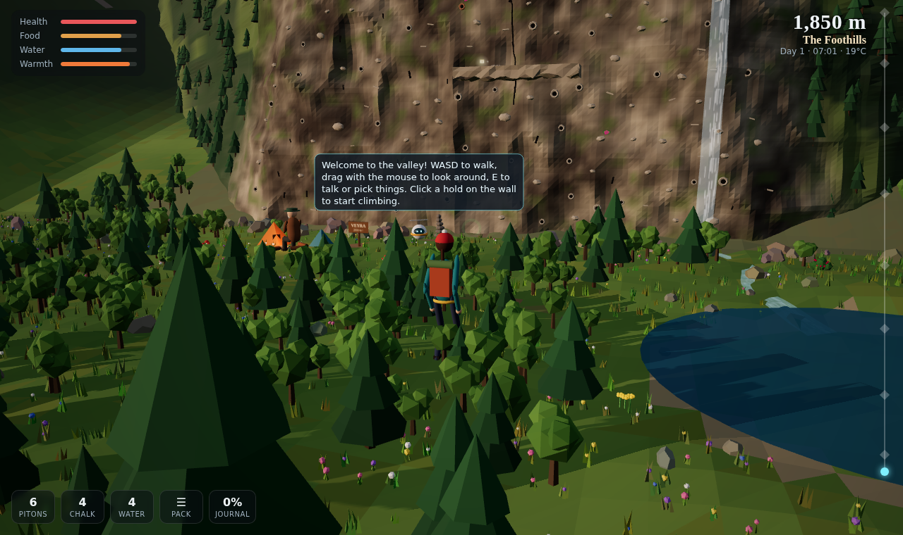
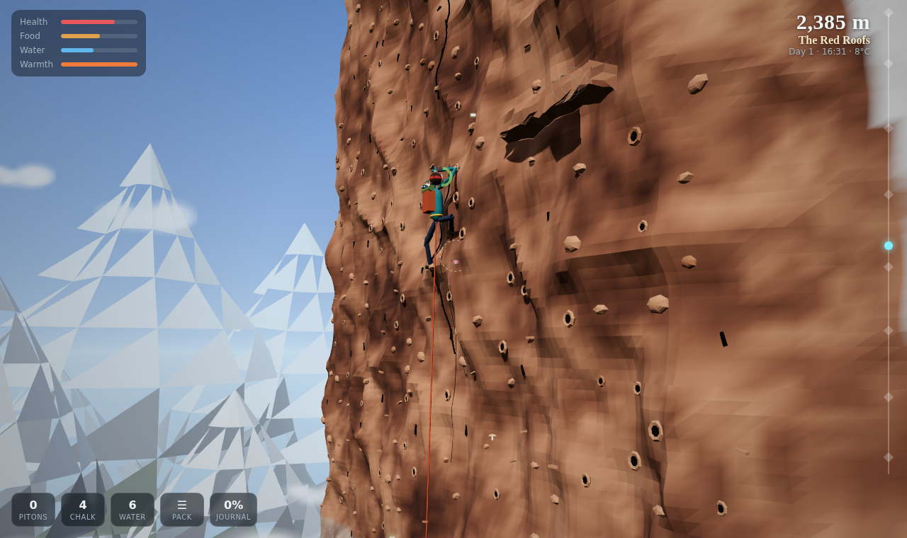
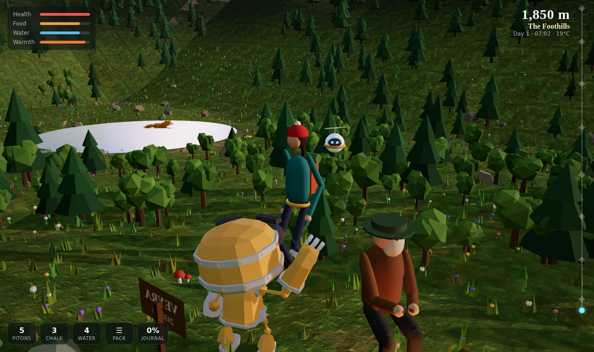
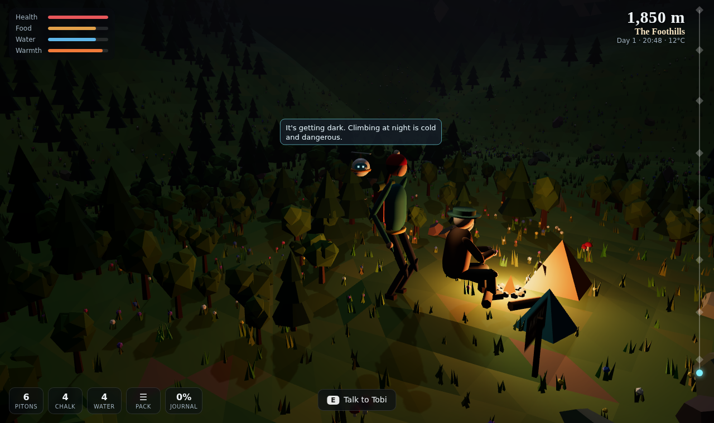
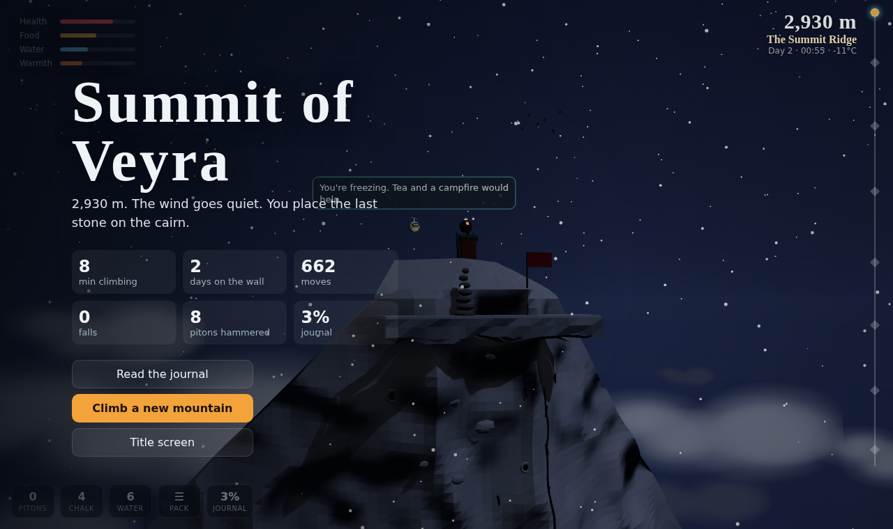
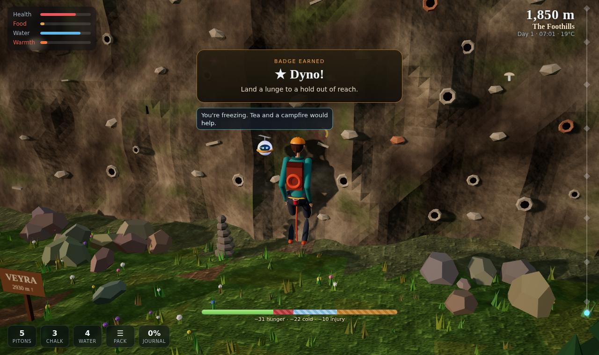

# VEYRA

**A free-climbing survival game that runs in the browser, in 3D.**
Place every hand and foot yourself, manage your grip, hammer pitons, camp on ledges, and climb 1,080 metres from the valley to the summit.

### ▶ [Play it in your browser](https://wf5psycho.github.io/veyra/)



| | |
|---|---|
|  |  |
|  |  |

## What it is

Inspired by *Cairn*. You don't press "climb": you move four limbs one at a time on a rock face, and your body follows.

- **Free-limb climbing.** Click a hold and the right hand or foot reaches for it, or drag a limb for precise placement. A position-based body solver keeps you within reach of every hold you hold.
- **Grip and stamina.** Small holds and overhangs burn your arms; good footholds let you rest. Chalk helps. At zero, your hands let go.
- **Rope and pitons.** Hammer pitons into cracks with a timing mini-game. Fall, and the rope catches you. A badly set piton can rip.
- **Survival.** Food, water and warmth cap your strength. It is colder higher up and at night. Cook at bivouacs, sleep, and save by stacking a cairn.
- **A climber built in code:** helmet with headlamp, harness with carabiners and chalk bag, pack with rope, climbing shoes, and hands that close around each hold.
- **Pip the climbot** follows you, gives tips, and flies back down to fetch the pitons you left behind.
- **The valley.** Walk around freely in 3D: talk to Tobi at base camp, pick berries that regrow every day, fill your flask at the lake.
- **A journal** of rare flowers, animals you spot, and relics that tell the story of an earlier expedition.
- **Hazards:** falling rock, crumbling holds, summit wind, darkness.
- **3D and 2D** views on the same engine (press V).

Almost everything you see and hear is generated by code: the procedural mountain, rock/ground/snow textures, the low-poly 3D world, sound and music. A few openly licensed assets add life: the climber (KayKit, rigged and animated), an animated fox, Kip the robot and HDRI lighting for reflections (see [credits](assets/CREDITS.md)).

**Inspired by PEAK too:** a stamina bar where hunger, cold and injuries visibly eat a striped chunk out of your grip, a *mountain of the day* that is the same for everyone and changes daily, a risky **lunge** for holds just out of reach, marshmallows to roast at the bivouac fire, and scout-style **badges**.



**Three difficulty levels.** *Easy* is relaxed, *Normal* (default) has fewer rests and longer reaches, *Alpinist* adds slipping hands and tiny holds. Tests prove every level can be climbed to the top.

## Built with AI

Designed and built with **Claude Code** (AI pair-programming), directed and play-tested by me. That covers the game design, engine, 3D world, tests, and this automated publishing pipeline.

## Controls

| Action | Input |
|---|---|
| Reach for a hold | Click it |
| Precise placement | Drag a hand or foot |
| Pick a limb | 1–4 · right-click cancels |
| Shift weight / walk (Shift = run) | WASD |
| Look around (3D) | Drag on empty space |
| Climb onto a ledge | W |
| Lunge for a hold just out of reach (yellow ring) | Space |
| Talk, pick, make camp | E |
| Piton / chalk / drink | F / C / T |
| Pack / journal / pause | I / J / Esc |
| 2D ⇄ 3D | V |

## How it's built

```
src/climber.js    climbing physics: limbs, body solver, stamina, falls, rope
src/world.js      procedural mountain: holds, cracks, ledges, valley
src/game.js       survival, inventory, camps, hazards, Pip, journal, saving
src/render3d.js   three.js renderer: mountain, climber, camera, lighting
src/env3d.js      3D nature: sky, peaks, forest, lake, waterfall, clouds
src/render2d.js   2D canvas renderer
src/autoclimb.js  an AI climber used in tests and on the title screen
tools/build.mjs   bundles everything into one HTML file
```

- `npm test`: headless simulation tests, including an AI climber that must reach the summit on several generated mountains.
- `npm run test:e2e`: plays the game in headless Chromium and takes screenshots.
- `npm run build`: writes `dist/veyra.html`, a single self-contained file.

Every push to `main` runs the tests, builds the game and publishes it to GitHub Pages.

## Embed it in a website

```html
<iframe src="https://wf5psycho.github.io/veyra/" title="VEYRA, a climbing game"
        width="100%" height="640" style="border:0;border-radius:12px"
        allow="fullscreen" allowfullscreen loading="lazy"></iframe>
```

## Credits

- Fox model by PixelMannen (CC0); rigging and animation by tomkranis (CC BY 4.0); glTF conversion by @AsoboStudio and @scurest (CC BY 4.0). From the Khronos glTF sample assets.
- The climber is "Rogue" from KayKit Adventurers 1.0 by Kay Lousberg (CC0), with a helmet, pack and harness added in code. Walking uses its own animations; on the wall the bones follow the climbing simulation.
- Kip the robot (RobotExpressive) by Tomás Laulhé / Quaternius (CC0), via the three.js examples.
- HDRI lighting from Poly Haven (CC0), via @pmndrs/assets.
- three.js and its loaders (MIT), see `vendor/three.LICENSE`.

Full list: [assets/CREDITS.md](assets/CREDITS.md). Game code © the author.
